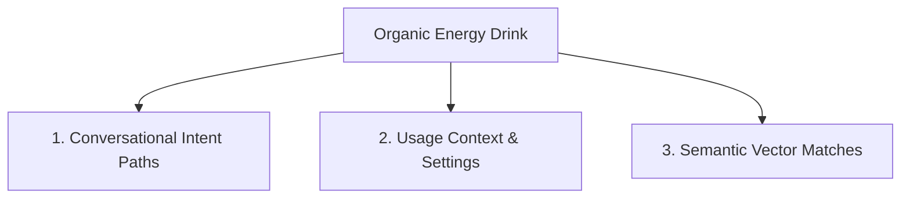

# Brainstorming Session: Amazon COSMO Semantic Expansion
**Topic:** Organic Energy Drink
**Date/Time:** 2026-05-30 08:17:14
---

> [!NOTE]
> The Amazon COSMO & Rufus optimization framework expands the semantic surface area of the listing to match natural consumer questions.

### 1. Conversational Buyer Intent Paths
Brainstorm the exact questions customers ask Google or Rufus before realizing they need **Organic Energy Drink**:
*   *Question A:* "What is the best way to solve [pain point solved by Organic Energy Drink]?"
*   *Question B:* "Is there a sustainable/premium alternative for [common alternative to Organic Energy Drink]?"
*   *Question C:* "How can I improve my daily routine when dealing with [target context]?"

### 2. Usage Contexts & Lifestyle Scenarios
Where and when is **Organic Energy Drink** used? Let's brainstorm the explicit settings to seed in our COSMO graph mapping:
*   *Setting/Location:* e.g., office desk, gym bag, morning ritual, kitchen drawer.
*   *Target Demographic Lifestyles:* e.g., eco-conscious parents, productivity enthusiasts, active outdoor adventurers.

### 3. Semantic Vector Association Targets
What complementary product terms or synonyms have high semantic overlap with **Organic Energy Drink** in embedding space?
*   *Synonyms:* __________________
*   *Complementary Products:* __________________
*   *Adjacent Categories:* __________________

### 🎯 Optimized Seed Recommendations
Draft 3 custom Q&A pairs combining these axes:
1.  **Q:** __________________ 
**A:** __________________
2.  **Q:** __________________ 
**A:** __________________
3.  **Q:** __________________ 
**A:** __________________
